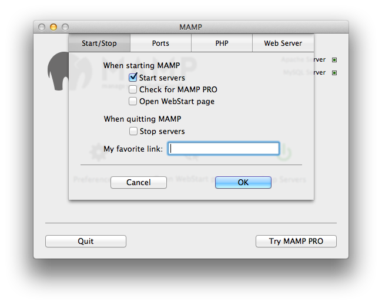
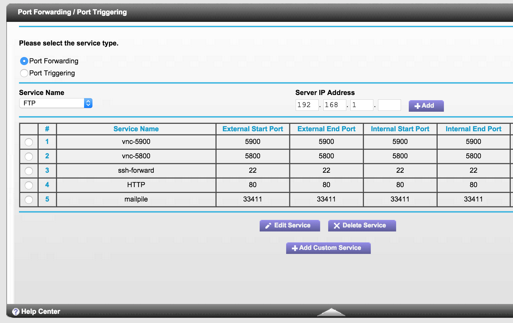

# How to set up an old MacBook as a server


# Why do such a crazy thing? 

## because you can host your own website

## because you can host your own media server

## because the internet is broken 

## because you can make a mean machine 

### Specifications of the BlackServer 

# 0. Start with a fresh computer

For my purposes, I installed Snow Leopard onto a BlackBook (the last black MacBook), updated to the last version of Snow Leopard, and then upgraded to Lion, and then patched Lion with all the updates I could lay my hands on. 

# 1. Install Stuff 

### 1.0 First, install the XCode Command Line Tools 

The last version I could install is `Command Line Tools (OS X Lion) for Xcode - April 2013`

Here's a [link](http://adcdownload.apple.com/Developer_Tools/command_line_tools_os_x_lion_for_xcode__april_2013/xcode462_cltools_10_76938260a.dmg) to the disk image. You'll need a free Apple Developer account to get this. 

### 1.1 Install `brew`

`brew` is a fantastic pckage manger for Mac OS X. You will definitely need this. Install with this single line:

```bash
ruby -e "$(curl -fsSL https://raw.githubusercontent.com/Homebrew/install/master/install)"
```

It will ask you for your password. Enter one. 

### 1.2 Install things using `brew`

Now that brew is installed, it is super easy to install a huge bunch of things. Note that some of these depend on the order you install them. 

```bash
brew install youtube-dl
brew install ruby
brew install git 
brew install ffmpeg
brew install node
```

*You can also `brew install thing1 thing2`*

Wow. we just installed a bunch of useful command line utilities. What about a browser and some GUI apps? `brew cask` has you covered. 

```bash
brew install caskroom/cask/brew-cask
brew cask install firefox
brew cask install mamp
brew cask install sublime-text
brew cask install torbrowser
brew cask install carbon-copy-cloner
brew cask install caffeine
brew cask install bittorrent-sync
```

### 1.3 Install some things that brew can't

#### NoSleep

The latest (v1.40) version of NoSleep is broken on Lion, and we'll have to install an older one. See this [issue](https://github.com/integralpro/nosleep/issues/5) on their repo page. You will have to download v1.3.3 [here](https://code.google.com/p/macosx-nosleep-extension/downloads/detail?name=NoSleep-1.3.3.dmg&can=2&q=) and manually install it. Make sure you enable "don't check for updates" because as of writing, the latest version is broken, and it will break itself trying to update. 

## 2. Configure the `BlackServer`

### 2.1 Set up a local static IP

Go to `System Preferences > Network` and set up a static IP as shown:


### 2.2 Enable remote access 

We'll need to get in and out of this computer from all over the world soon. And in the beginning at least, it would be nice to have a way to log into the computer and see the screen. Let's set up all this in `System Preferences > Sharing`


But we're not done yet! For added security, let's configure `BlackServer` so that we can SSH into it only using **public key authentication**. This way, there are no passwords to type in, and it's much harder for someone to break into our computer. 

Assuming you have made your SSH keys on your local machine (*not* `BlackServer`!), copy them to `BlackServer`

```bash
scp ~/.ssh/id_rsa.pub user@blackserver:~/Desktop/
```

Now, on `BlackServer`, run this:


```bash
mkdir ~/.ssh
cat ~/Desktop/id_rsa.pub >> ~/.ssh/authorized_keys
```

OK. `BlackServer` can now verify your local machine using public key crytography. Now we need to configure `BlackServer` to do so:

Fire up Sublime Text to edit the ssh config file:  

```bash
subl /etc/sshd_config
```
and uncomment these lines 

```bash
RSAAuthentication yes
PubkeyAuthentication yes
AuthorizedKeysFile	.ssh/authorized_keys
```

Also, let's prevent authentication using passwords. Change this file to:

```bash
# To disable tunneled clear text passwords both PasswordAuthentication and
# ChallengeResponseAuthentication must be set to "no".
PasswordAuthentication no
#PermitEmptyPasswords no

# Change to no to disable s/key passwords
ChallengeResponseAuthentication no
````
### 2.3 Configure MAMP

Start MAMP (be careful not to run MAMP Pro, which will also be installed) and set it up as follows:




It's sensible to put the `document root` of the MAMP server in ~/Sites, since it is already created for you, and you have write permissions here. 

OK, let's see if this works: 


Despite this joyous message, this is not an indication that our MAMP installation works. Remembering that we started an Apache server on port 8888, verify that there is an Apache start page there:


Good! Now, let's check if MAMP has actually been installed:


### 2.4 Configure a global name 

It would be nice to access `BlackServer` from anywhere in the world. Right now, we can't do that, for two reasons:

1. we don't know where in the internet `BlackServer` is 
2. the router that `BlackServer` is on doesn't know what to do with packets coming from and going to `BlackServer`

Let's address both problems. 

To tell your router how to pass on messages to/from `BlackServer`, you need to do something called **port forwarding**. Unforutunately, every router is different, and some routers are so stupid they don't allow you to do that. You have to figure out how to do this on yours. Go to your router's admin page (usually 192.168.1.1) and enter your username and password (usually admin/admin or something silly)

Find a page that looks like this, and add entries as follows:



The specific ports you forward depend on the applications and servies you will install on your server, but you get the idea. 


# Install applications on your server

## [wallabag](http://wallabag.org)


